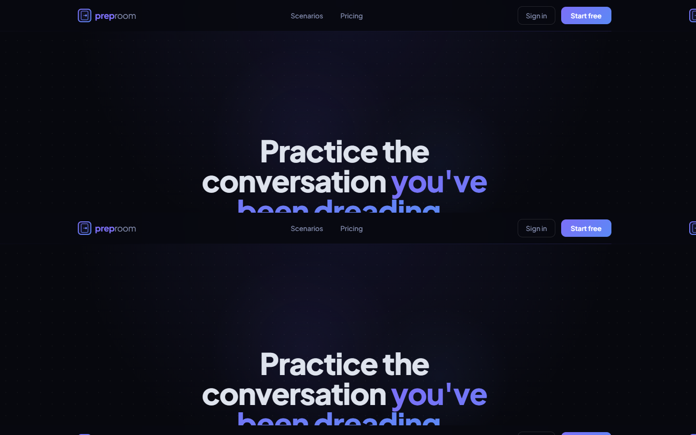
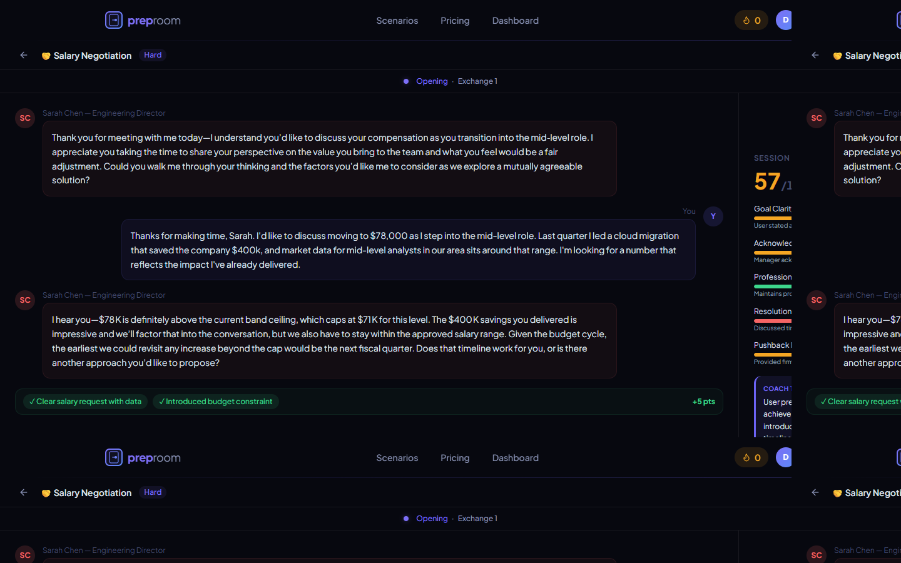
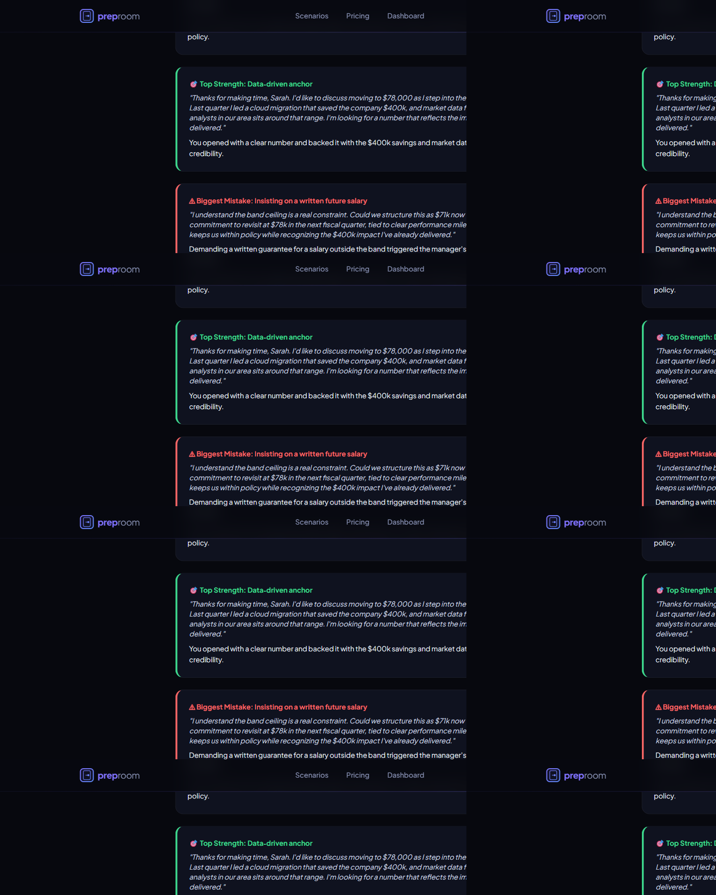
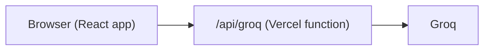

# Preproom

Practice the workplace conversations you're dreading, with an AI counterpart that pushes back and a coach that scores you.

🏆 Winner, Product Pitch Hackathon, AI Biz Club at UT Dallas

**Try it live:** [https://preproom-kappa.vercel.app](https://preproom-kappa.vercel.app)



## The problem

People rehearse presentations. Almost nobody rehearses salary negotiations, promotion asks, or tough feedback conversations — the ones where the stakes are personal and there's no safe place to practice.

## What it does

- **5 scenarios** — salary negotiation, asking for a promotion, challenging a decision, responding to critical feedback, and a job interview — plus **Practice Any Conversation** for custom situations.
- **Interview mode** parses your CV (PDF, in the browser) and an optional job description, then asks questions specific to it (screening, behavioural, technical, or final round).
- A **realistic counterpart** that follows a tension arc (opening → pushback → escalation → crisis → resolution) and ends the conversation on its own.
- **Live scoring** on 5 weighted dimensions, then a **coaching debrief** with verbatim quotes, your top strength, your biggest mistake with a better version, a round-by-round breakdown, and a recommended next scenario.

## Screenshots

### Mid-session with live score panel



### Coaching debrief



## How it works

### Three-layer prompt architecture

1. **Persona generation** — returns JSON (name, role, company, opening line), or locks a preset persona and only generates the opening.
2. **Session prompt** — one Groq call returns the in-character reply **and** a JSON scoring block, separated by a `---SCORE---` delimiter and parsed client-side (`parseSessionResponse` in `src/lib/groq.ts`).
3. **Debrief prompt** — returns structured coaching JSON (verdict, top strength, biggest mistake, round breakdown, next scenario).

### Scoring engine (`src/lib/scoring.ts`)

Five weighted dimensions:

| Dimension | Weight |
|---|---|
| Goal clarity | 25% |
| Acknowledgment | 20% |
| Professionalism | 20% |
| Resolution progress | 20% |
| Pushback handling | 15% |

Dimensions stay **"not assessed"** until observed. Deltas are capped so scores move gradually. Calibration bands push strong sessions toward **78–92**, not 100.

### Prompt calibration

The session prompt counters the model's natural agreeableness with scripted speech patterns, visible frustration and softening, and references to earlier messages — so the counterpart pushes back instead of folding.

### Stateless context

Full conversation history is resent on every call. There is no server-side session store for the chat.

### Secure LLM access

All Groq calls go through a Vercel serverless function (`api/groq.ts`). The API key never reaches the browser. The proxy adds input validation, token and size caps, a per-IP rate limit, and does not log request bodies. The model is configurable via `GROQ_MODEL` (default `openai/gpt-oss-120b`).

## Architecture



```
Browser (React / Vite)
        │
        ▼
  /api/groq  (Vercel serverless)
        │
        ▼
      Groq API
```

## Tech stack

React, TypeScript, Vite, Tailwind, shadcn/ui, Framer Motion, pdf.js, Vercel Functions, Groq.

## Run locally

```bash
npm install
cp .env.example .env   # add GROQ_API_KEY
npx vercel dev
```

`vercel dev` is required so `/api/groq` runs. Plain `npm run dev` serves the UI only and will fail on chat calls.

## Deploy

Deploy to Vercel and set:

- `GROQ_API_KEY` (required)
- `GROQ_MODEL` (optional; default `openai/gpt-oss-120b`)

## Known limitations

- **Demo-only auth** — accounts live in `localStorage`, not secure.
- **Session history** lives in the browser.
- **Rate limit** is in-memory per serverless instance (not shared across instances).
- **Scoring** happens in the same call as the roleplay reply.

## Future work

- Separate evaluator call for more objective scoring
- Real auth and a database
- Voice mode
- More scenarios

## License

MIT — see [LICENSE](LICENSE).
